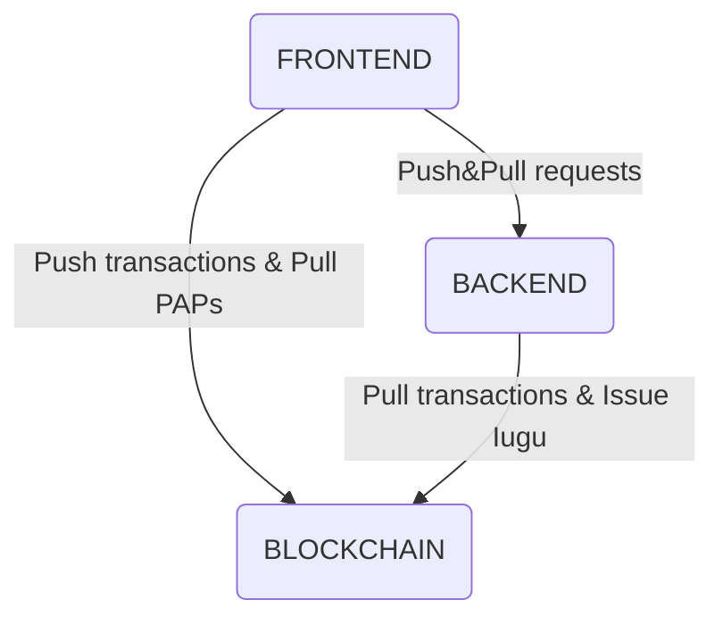

# CristalNetwork REST & GraphQL API
This is a step by step guide to launch an instance of CristalNetwork Backend API. 
This doc will try to guide you through:
1. Setting up the dev environment, 
2. Configuring Blockchain parameters,
3. Configuring DDBB parmeters,
4. Configuring Google Drive Storage parmeters,
5. Configuring Payment Gateway parameters [https://iugu.com](https://iugu.com/),
6. Running a local Backend Instance.

## Intro
This REST and GraphQL API is part of the CristalNetwork Core Apps.

#### Services
* Pull blockchain transactions for configured [https://github.com/cristalnetwork/inkiri-eos-contracts](https://github.com/cristalnetwork/inkiri-eos-contracts) instance contract and keep a local record on a MongoDB instance.
* Pull [IUGU Payment Gateway](https://iugu.com) payments for configured accounts using [IUGU API](https://dev.iugu.com/reference), and issues corresponding amount of money to recipients' bank account balance. This is the way money is issued.
* Provides a GraphQL API to access data:
  * Account requests:
    * Deposit
    * Exchange
    * Payment
    * Provider
    * Send
    * Withdraw
    * Service
    * Pad
    * Salary
    * Iugu/Issue
  * Users
    * Personal information
    * Commercial bank accounts to whom withdraw are requested
  * Services (B2B and B2C services) and Pre Authorized Debits Contracts
  * Providers
  * Businesses Teams
  * IUGU operations 
* Authentication through EOSIO Contract Auth and JWT.
#### Administrator accounts services
* Administrate users
  * Create Account
  * Configure accounts' overdraft (The **overdraft** allows the **customer** to continue paying bills even when there is insufficient money in the **customer's** account.)
* Administrate the bank
  * Access all transactions.
  * Possibility to change requests statuses, such as cancel withdraw or accept an exchange reques.
  * Administrate suppliers
  * Manage external transfers (outside the economy)
#### Personal account services
* Hire services and managing recurring payments (Pre Auth Debits)
* Authorize other accounts to manage balances or just to view transaction list.  
* Request payments.
* Withdraw paper money and convert money to FIAT currency and credit at commercial bank account.
#### Business accounts services
* Administrate supplier
* Request supplier payment through FIAT money conversion.
* Administrate a team
* Pay salaries
* Create services and invite customers to Pre Authorized Debits.
* Charge PAD slips.
* Point of Sale
  * Authorize other accounts to charge customers and view payments.  
  * Charge customers for service and product, allowing in-app payment.
## Setup Dev Environment
Please make sure that you have:
- Node.js installed (https://nodejs.org/) 
Min version required is 10.16.0, please refer to this[installation guide].(https://github.com/nodesource/distributions/blob/master/README.md#debinstall)
- Have [MongoDB](https://www.mongodb.com/) installed and running locally in `replica set` mode.
  - Here is a simplified commands guide. Please refer to [this link](https://thecodebarbarian.com/introducing-run-rs-zero-config-mongodb-runner.html#your-first-transaction-with-run-rs-and-mongodb-40) for detailed installation instructions.
  ```bash
  npm install run-rs -g
  run-rs --keep --mongod --dbpath /path_to_cristalnetwork/mongodata -v 4.0.0 --shell
  ```
  - If you are used to **docker**, please refer to [this link](https://gist.github.com/harveyconnor/518e088bad23a273cae6ba7fc4643549).
  - You may also take a look at [Atlas Mongo Cloud Service](https://www.mongodb.com/cloud/atlas), they have an amazing free tier.
- Finally, run `npm install` in your root project folder

## Configuration
Copy `project_root_path/src/common/config/env.cristaltoken.config_SAMPLE_.js` to `project_root_path/src/common/config/env.cristaltoken.config.js` by running:
```bash
cd project_root_full_path
cp ./src/common/config/env.cristaltoken.config_SAMPLE_.js ./src/common/config/env.cristaltoken.config.js
```
You will have to configure app parameters by replacing:
* **<JWT_SECRET>** with a secret key to sign JWT tokens. 
* **<MONGOBD_CONNECTION_URI>** with your MongoDB connection URI (if you are running a local server the connection might be something like _mongodb://localhost:27017,localhost:27017,localhost:27017/?replicaSet=rs&retryWrites=true&w=majority_) 
* **<BLOCKCHAIN_CURRENCY_SYMBOL>** currency symbol of the blokchain. TLOS for TELOS blockchain, EOS for EOS blockchain, SYS for a Local Single-Node Testnet blockchain
* **<BLOCKCHAIN_ACCOUNT_NAME>** EOSIO account name used [here](https://github.com/cristalnetwork/inkiri-eos-contracts#setup-dev-environment)
* **<BLOCKCHAIN_TOKEN_SYMBOL>** token symbol used [here](https://github.com/cristalnetwork/inkiri-eos-contracts#4-create-the-bank-contract-token) 
* **<GOOGLE_DRIVE_ID>** Enabled folder for project.

#### Blockchain
_missing text_

#### DDBB
_missing text_

#### Google Drive Storage
Please refer to [https://medium.com/@bretcameron/how-to-use-the-google-drive-api-with-javascript-57a6cc9e5262#7640](https://medium.com/@bretcameron/how-to-use-the-google-drive-api-with-javascript-57a6cc9e5262#7640) and save private key onto this file: `./src/common/config/drive.credentials.json`

#### IUGU: Payment Gateway
_missing text_

## Usage
To run the project, please use a command line the following:
```bash
IUGU_ISSUER_PRIVATE_KEY=<YOUR_ADMIN_ACCOUNT_PRIVATE_KEY> npm start
```
> Please note the private key is the one generated [at this link](https://github.com/cristalnetwork/inkiri-eos-contracts#setup-dev-environment).
- It will run the server at port 3600.
