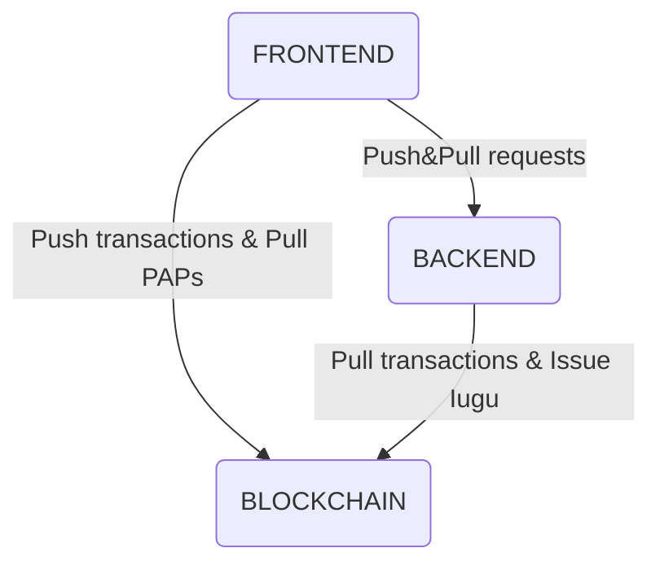

# CristalNetwork REST & GraphQL API
This is a step by step guide to launch an instance of CristalNetwork Backend API. 
This doc will try to guide you through:
1. Setting up the dev environment, 
2. Configuring parameters 
  1. Blockchain parameters,
  2. DDBB parmeters,
  3. Google Drive Storage parmeters -_optional_-,
  4. Payment Gateway parameters [https://iugu.com](https://iugu.com/) -_optional_-,
  5. Firebase Push Notification service -_optional_-,
3. Running a local Backend Instance.

## Intro
This REST and GraphQL API is part of the CristalNetwork Core Apps.

#### Services
* Pull blockchain transactions for configured [https://github.com/cristalnetwork/inkiri-eos-contracts](https://github.com/cristalnetwork/inkiri-eos-contracts) instance contract and keep a local record on a MongoDB instance.
* Pull [IUGU Payment Gateway](https://iugu.com) payments for configured accounts using [IUGU API](https://dev.iugu.com/reference), and issues corresponding amount of money to recipients' bank account balance. This is the way money is issued.
* Provides a GraphQL API to access data:
  * Account requests:
    * Deposit
    * Exchange
    * Payment
    * Provider
    * Send
    * Withdraw
    * Service
    * Pad
    * Salary
    * Iugu/Issue
  * Users
    * Personal information
    * Commercial bank accounts to whom withdraw are requested
  * Services (B2B and B2C services) and Pre Authorized Debits Contracts
  * Providers
  * Businesses Teams
  * IUGU operations 
* Authentication through EOSIO Contract Auth and JWT.
#### Administrator accounts services
* Administrate users
  * Create Account
  * Configure accounts' overdraft (The **overdraft** allows the **customer** to continue paying bills even when there is insufficient money in the **customer's** account.)
* Administrate the bank
  * Access all transactions.
  * Possibility to change requests statuses, such as cancel withdraw or accept an exchange reques.
  * Administrate suppliers
  * Manage external transfers (outside the economy)
#### Personal account services
* Hire services and managing recurring payments (Pre Auth Debits)
* Authorize other accounts to manage balances or just to view transaction list.  
* Request payments.
* Withdraw paper money and convert money to FIAT currency and credit at commercial bank account.
#### Business accounts services
* Administrate supplier
* Request supplier payment through FIAT money conversion.
* Administrate a team
* Pay salaries
* Create services and invite customers to Pre Authorized Debits.
* Charge PAD slips.
* Point of Sale
  * Authorize other accounts to charge customers and view payments.  
  * Charge customers for service and product, allowing in-app payment.
## 1.- Setup Dev Environment

Please make sure that you have:

### Node.js installed (https://nodejs.org/) 
Min version required is 10.16.0, please refer to [this installation guide].(https://github.com/nodesource/distributions/blob/master/README.md#debinstall)

### [MongoDB](https://www.mongodb.com/) running in `replica set` mode.

##### Option 1: Local MongoDB Instance
We composed this tiny simplified guide. Please refer to [this link](https://thecodebarbarian.com/introducing-run-rs-zero-config-mongodb-runner.html#your-first-transaction-with-run-rs-and-mongodb-40) for detailed installation instructions.
 ```bash
npm install run-rs -g
run-rs --keep --mongod --dbpath /path_to_cristalnetwork/mongodata -v 4.0.0 --shell
```
##### Option 2: Docker MongoDB Instance
If you are used to **docker**, please refer to [this link](https://gist.github.com/harveyconnor/518e088bad23a273cae6ba7fc4643549).
##### Option 3: Third party MongoDB Services
You may also take a look at [Atlas Mongo Cloud Service](https://www.mongodb.com/cloud/atlas), they have an amazing free tier.
### Install npm modules
Finally, run `npm install` in your root project folder

## Configuration
Please copy sample configuration file `project_root_path/src/common/config/env.cristaltoken.config_SAMPLE_.js` to `project_root_path/src/common/config/env.cristaltoken.config.js` by running:
```bash
cd project_root_full_path
cp ./src/common/config/env.cristaltoken.config_SAMPLE_.js ./src/common/config/env.cristaltoken.config.js
```

#### JWT secret string
The API implements JWT (JSON Web Token) for users and requests authentication.
When a user authenticates itself onto the platform, the backend server provides a token for the client to be used in further requests.
**JWT is created with a secret key** and that secret key is private to the server instance. When the server instance receive a JWT from the client, the server verifies that JWT with the secret key. Any modification to the JWT will result into verification failure.

Replace **<JWT_SECRET>** with your secret key in this file `project_root_full_path/src/common/config/env.cristaltoken.config.js`.

Please refer to the following links for further information [https://jwt.io](https://jwt.io/) and [https://github.com/auth0/node-jsonwebtoken](https://github.com/auth0/node-jsonwebtoken).

#### Blockchain
You will have to configure the blockchain currency symbol, the account name you use to deploy the contract and the endpoints.

Replace **<BLOCKCHAIN_CURRENCY_SYMBOL>** in this file `project_root_full_path/src/common/config/env.cristaltoken.config.js` with the currency symbol of the blokchain. Use **TLOS** for TELOS blockchain, **EOS** for EOS blockchain, **EOS** for a Local Single-Node Testnet blockchain.

Replace **<BLOCKCHAIN_ACCOUNT_NAME>** in this file `project_root_full_path/src/common/config/env.cristaltoken.config.js` with the EOSIO account name used [here](https://github.com/cristalnetwork/inkiri-eos-contracts#setup-dev-environment) to deploy the contract.

Replace **<BLOCKCHAIN_TOKEN_SYMBOL>** in this file `project_root_full_path/src/common/config/env.cristaltoken.config.js` with the token symbol used [here](https://github.com/cristalnetwork/inkiri-eos-contracts#4-create-the-bank-contract-token) for the currency you issue. 

You wil have to configure the blockchain endpoints too.
```json
{
  "eos" : {
        "blockchain_endpoint_prod":    "http://localhost:8888",         // http://localhost:8888 for Local Single Node testnet, https://telos.eoscafeblock.com for TELOS
        "blockchain_endpoint_dev":     "http://localhost:8888",         // http://localhost:8888 for Local Single Node testnet, https://testnet.telosusa.io
        "hyperion" :{
          "history_endpoint_prod":      "https://telos.caleos.io",      // http://localhost:8888 for Local Single Node testnet , https://telos.caleos.io for TELOS
          "history_endpoint_dev" :      "https://testnet.telosusa.io"   // http://localhost:8888 for Local Single Node testnet , https://testnet.telosusa.io for TELOS
  }
}
```
For more info about network params please [refer to this link](https://developers.eos.io/manuals/eosjs/latest/how-to-guides/how-to-set-the-network).
As you may have noticed, the configuration file allows you to configure 4 endpoints. 
The blockchain _state_ endpoint for pushing transactions in the *prod*and *dev* environments configuration modes, and the blockchain _history_ hyperion endpoint for retrieving history data in the *prod* and *dev* environments configuration modes.

Here is a non exhaustive list of endpoint you may use accordingly to the network:
|                |MAINNET                        |TESTNET                      |
|----------------|-------------------------------|-----------------------------|
|EOS             | https://api.eoseoul.io        | https://jungle2.cryptolions.io|
|EOS Hyperion    | https://mainnet.eosn.io       | https://jungle.hyperion.eosrio.io/ |
|TELOS           | https://telos.eoscafeblock.com | https://testnet.telosusa.io|
|TELOS Hyperion   | https://telos.caleos.io      | https://testnet.telosusa.io |
|Local Single-Node | http://localhost:8888       | http://localhost:8888 |

You may take a look at this link for EOS and TELOS endpoints [https://tools.eosmetal.io/nodestatus/eos](https://tools.eosmetal.io/nodestatus/eos).
You can also check the Hyperion Open History Endpoint List available at [https://t.me/EOSHyperion](https://t.me/EOSHyperion)

#### Mongo DDBB
Replace **<MONGOBD_CONNECTION_URI>** with your MongoDB connection URI in this file `project_root_full_path/src/common/config/env.cristaltoken.config.js`.

If you are running a local server the connection might be something like this
```bash
mongodb://localhost:27017,localhost:27017,localhost:27017/?replicaSet=rs&retryWrites=true&w=majority
```

#### Google Drive Storage
Replace **<GOOGLE_DRIVE_ID>** with your Google drive folder ID. This folder will be used to store private files will be located (files such as Invoices and Receipts).
Please refer to [https://medium.com/@bretcameron/how-to-use-the-google-drive-api-with-javascript-57a6cc9e5262#7640](https://medium.com/@bretcameron/how-to-use-the-google-drive-api-with-javascript-57a6cc9e5262#7640) and save private key onto this file: `./src/common/config/drive.credentials.json`

#### IUGU: Payment Gateway
`>>missing text<<`

#### Firebase Push Notification
`>>missing text<<`

## Usage
To run the project, please use a command line the following:
```bash
IUGU_ISSUER_PRIVATE_KEY=<YOUR_ADMIN_ACCOUNT_PRIVATE_KEY> npm start
```
> Please note the private key is the one generated [at this link](https://github.com/cristalnetwork/inkiri-eos-contracts#setup-dev-environment).

It will run the server at port 3600.
